# AWS to Azure SOC Lab

## Overview

This project shows a simple SOC lab using AWS and Azure.

A Windows Server was created in AWS EC2. Sysmon was installed to collect logs.  
These logs were sent to Azure and analyzed in Microsoft Sentinel.

The goal is to simulate real attack behavior and detect it using KQL queries.

---

## Architecture

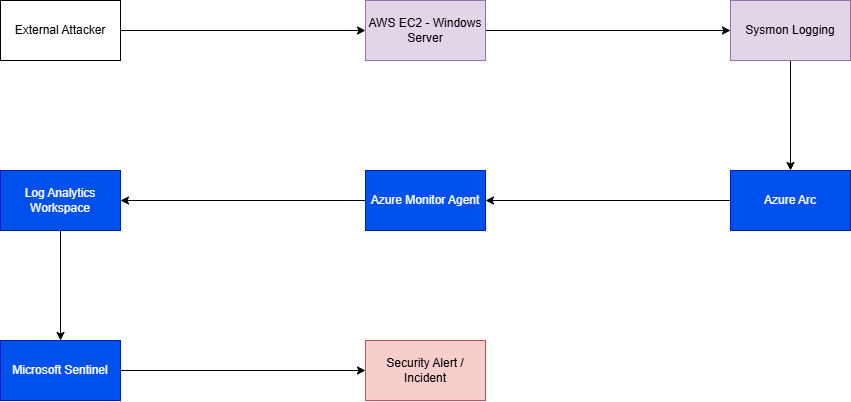

This diagram shows the full data flow from AWS to Azure Sentinel.

---

## Lab Setup

### AWS EC2 Setup

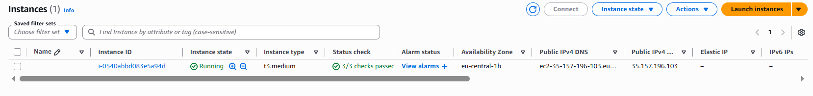

A Windows Server instance was created in AWS EC2.

---

### Sysmon Installation

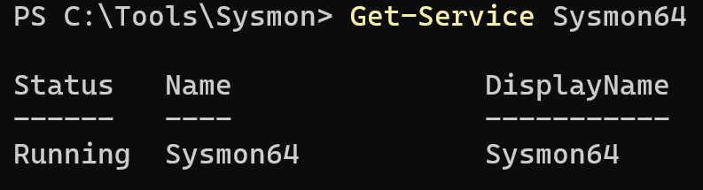

Sysmon was installed to collect system activity logs.

---

### Sysmon Test

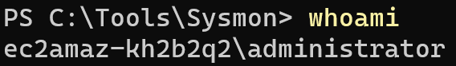

A test command (whoami) was executed to generate events.

---

### Event Viewer Check

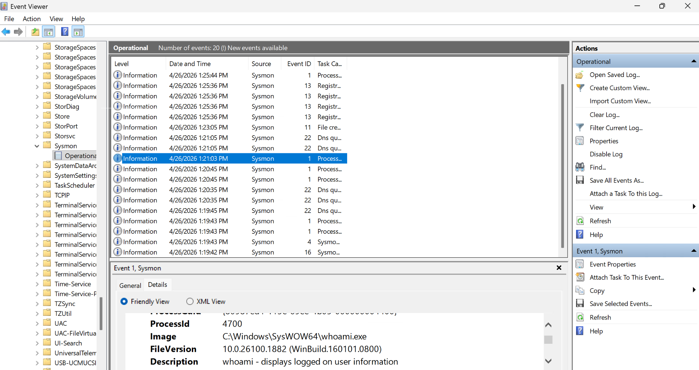

Sysmon logs were verified in Event Viewer.

---

## Azure Integration

### Microsoft Sentinel Setup

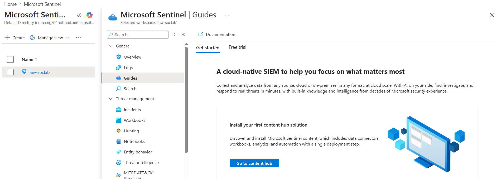

Microsoft Sentinel was enabled on the workspace.

---

### Azure Arc Connection

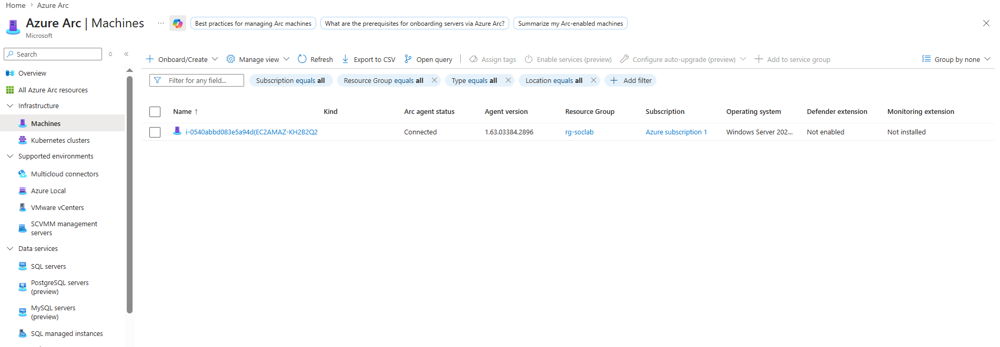

The AWS EC2 machine was connected using Azure Arc.

---

### Azure Monitor Agent

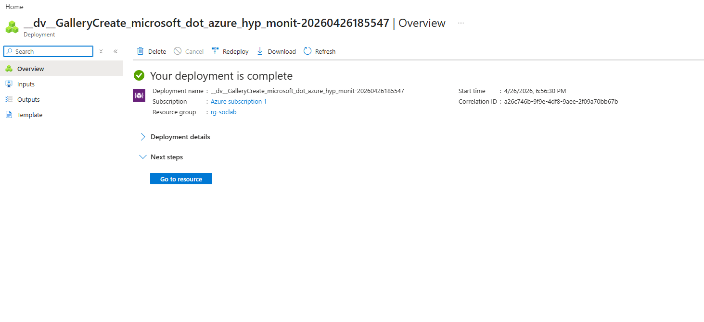

Azure Monitor Agent was installed on the machine.

---

### Data Collection Rule

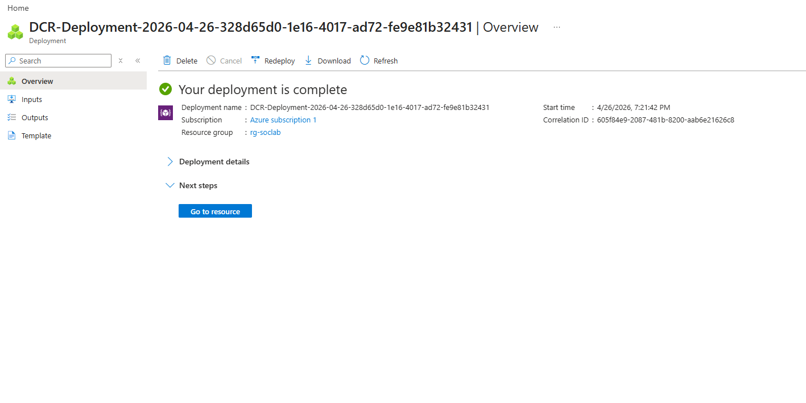

Data Collection Rules were configured to collect logs.

---

### Logs in Sentinel

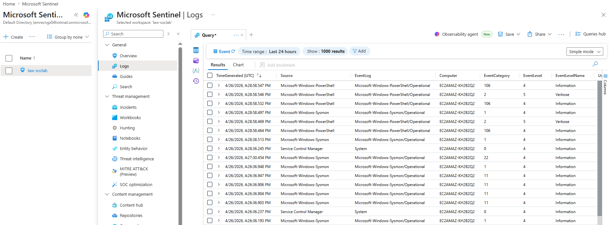

Logs started to appear in Microsoft Sentinel.

---

## Detection & Analysis

### Analytics Rules

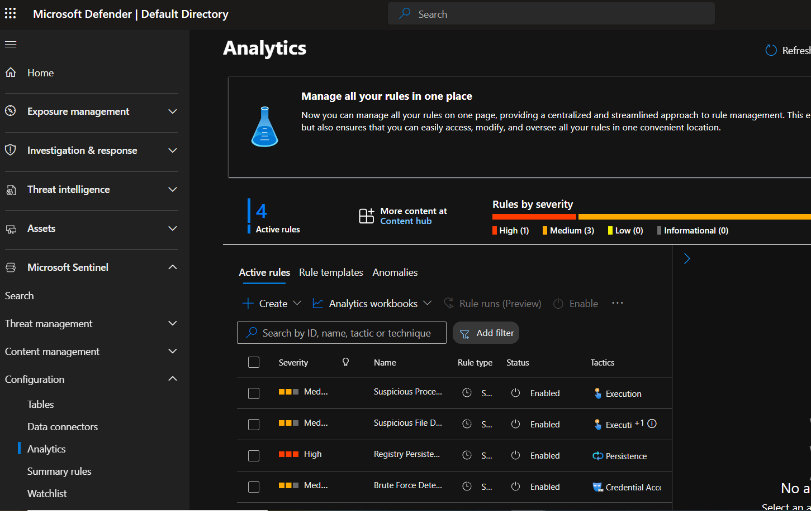

Custom detection rules were created using KQL.

---

### Alerts

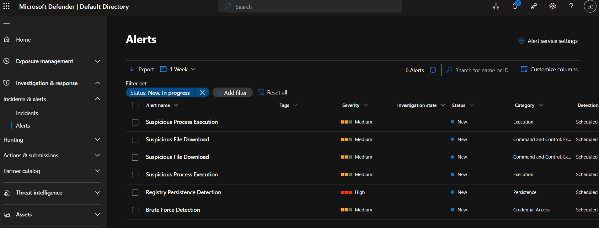

Alerts were generated based on custom analytics rules.

- Brute force detection identified multiple failed login attempts in a short time  
- Suspicious file download activity was detected using PowerShell with external URLs  
- Suspicious process execution detected commands like whoami and net user  
- Registry persistence activity was flagged when run keys were modified  

These alerts simulate real attacker behavior and show how detection works in a SOC environment.

---

## Results

### Incidents

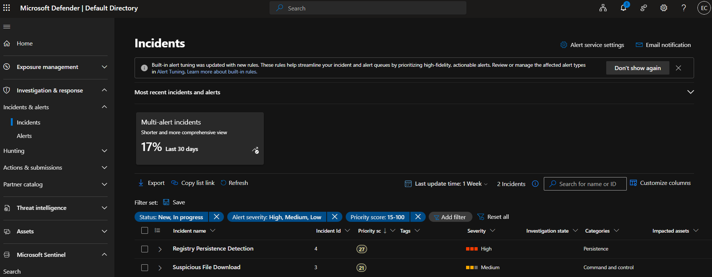

Detected alerts were grouped into incidents.

---

## Conclusion

This project demonstrates a basic SOC workflow.

It includes:

- Log collection with Sysmon  
- Data ingestion to Azure  
- Threat detection using KQL  
- Alert and incident creation  

This lab helped me understand how real SOC environments work.
